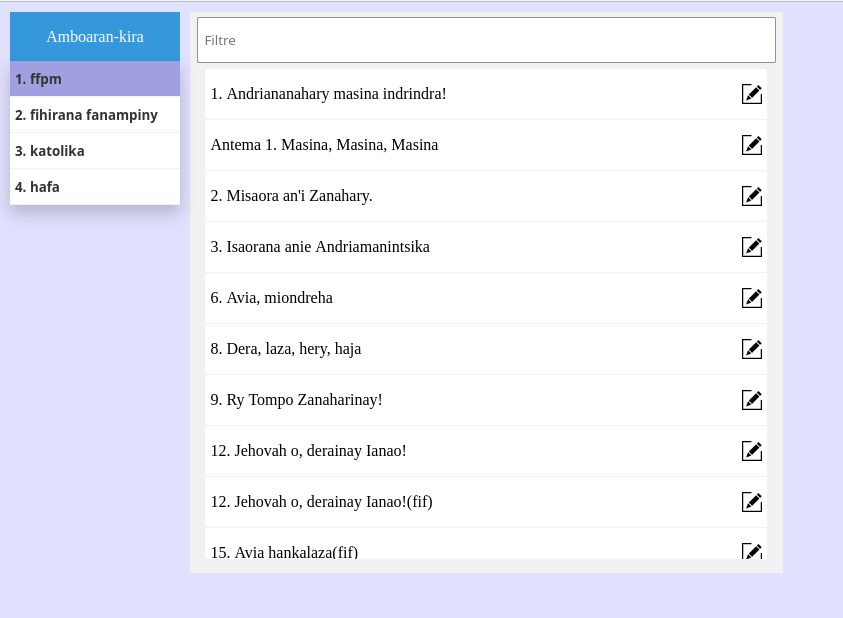
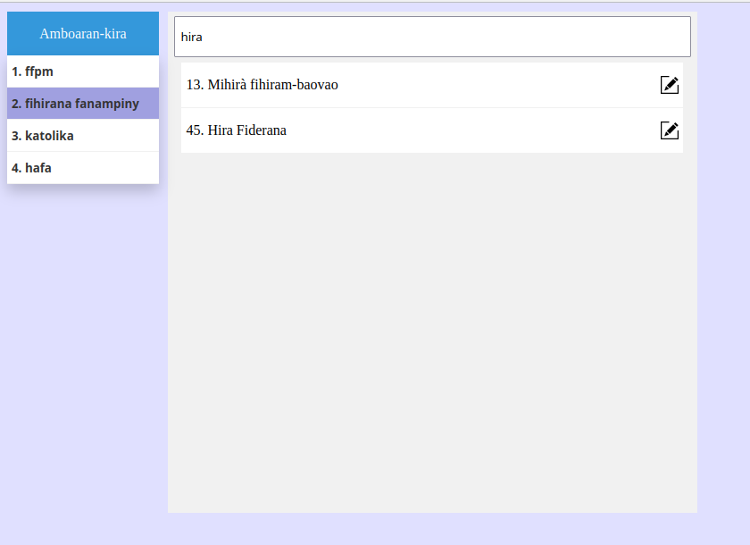
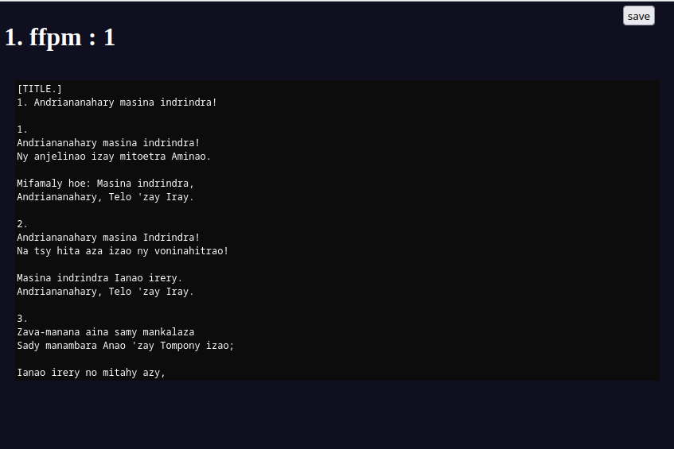
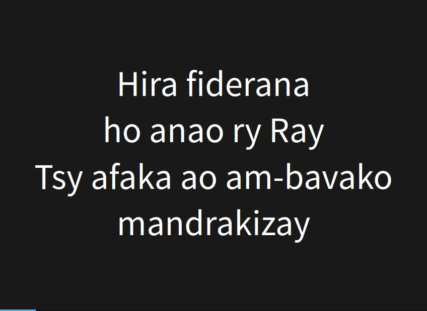

# Hiranay: Real-time Lyrics Management & Synchronization System

Hiranay is a web-based platform designed to manage, format, and broadcast song lyrics in real-time. Built with **Flask** and **Socket.io**, it allows an administrator to edit lyrics and instantly synchronize the display across all connected screens (projection, mobile devices, etc.) without refreshing the page.

## 📸 Screenshots Gallery

|             Main Library              |             Search & Filter             |
| :-----------------------------------: | :-------------------------------------: |
|  |  |

|               Raw Data Editor               |      Live Projection (Reveal.js)      |
| :-----------------------------------------: | :-----------------------------------: |
|  |  |

## 🚀 Key Features

- **Real-time Synchronization**: Powered by WebSockets (`Socket.io`), any change saved in the editor is immediately pushed to all live viewers.
- **Dynamic Data Formatting**: A custom Python-based parser transforms simple text files into structured HTML slides compatible with **Reveal.js**.
- **Live Editor**: A built-in web editor with keyboard shortcuts (Ctrl+S) for rapid content updates during live events.
- **Smart Sorting**: Implements intelligent data sorting that handles numeric prefixes and Malagasy accents (using `unicodedata` normalization).

------

## 🏗️ System Architecture

The project follows a modular design to separate data storage, processing, and delivery:

1. **Data Layer (`/sources`)**: Plain text files organized by "collections" (folders). This makes the system extremely portable and easy to back up.
2. **Processing Layer (`formatter.py`)**: A custom ETL-like script that:
   - Parses metadata (Titles, Chorus tags).
   - Injects content into responsive HTML templates using Python's `string.Template`.
3. **Delivery Layer (`app.py`)**: A Flask server managing the web routes and the WebSocket communication hub.

------

## 🛠️ Tech Stack

- **Backend**: Python, Flask, Flask-SocketIO.
- **Frontend**: JavaScript (Vanilla), Reveal.js for smooth slide transitions, CSS3.
- **Data Processing**: Regex, Unicodedata (NFD normalization).

------

## ⚙️ Custom Markup Language

To keep data entry simple for non-technical users, I implemented a simple markup system:

- `[TITLE.]`: Defines the song title.
- `[FIV.]`: Defines the chorus (reusable section).
- Double line breaks separate the verses/slides.

------

## 🚀 Installation & Usage

1. **Install dependencies**:

   Bash

   ```
   pip install flask flask-socketio
   ```

2. **Run the server**:

   Bash

   ```
   python app.py
   ```

3. **Access the app**:

   - Main Index: `http://localhost:5000`
   - Live Display: Click on a song title.
   - Editor: Click on the "Edit" icon next to a song.

